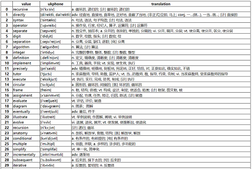

# README

scripts for converting
[Typing Learning](https://github.com/tangshimin/typing-learner) Vocabulary(json)
into pdf

NOTE: There's a bug for Chinese html2pdf unfixed.

NOW: json2html works well, and the output HTML file can be printed.



## Quickstart

- requires Python3 and `json`, `pandas`

```
pip install json
pip install pandas
```

- run `json2html.py`

```
python json2html.py -i ./test/test1.json -o ./test/test1.html
```

**Argv**:

- `-h` : print help
- `-i` : Vocabulary path
- `-o` : output HTML path
- `-c` : HTML table columns, default `value,ukphone,translation`, split by `,`

avalible columns: value, usphone, ukphone, definition, translation, bnc, frq

If input columns not in the list above, table adds new BLANK columns.

